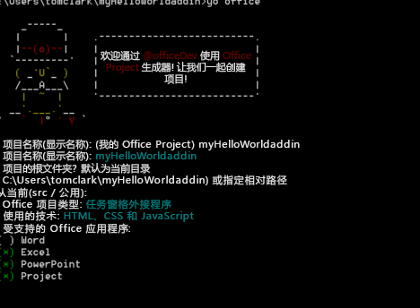

# 使用任何编辑器创建 Office 外接程序

Office 外接程序是你可以将其托管在 Office 应用程序内的 Web 应用。本文介绍了如何使用 Yeoman 生成器提供项目基架和内部版本管理，而 `manifest.xml` 文件则告知 Office 应用程序你的外接程序所在位置以及你希望其出现的方式。Office 应用程序负责将外接程序托管在 Office 中。

 >**注释**  这些说明包括使用 Windows 命令提示符的步骤，它们也同样适用于其他命令行管理程序环境。 


## Yeoman 生成器的先决条件

若要运行 Yeoman Office 生成器，您需要以下各项：


- [Git](https://git-scm.com/downloads)
    
- [npm](https://www.nodejs.org/en/download)
    
- [Bower](http://bower.io/)
    
- [Yeoman Office 生成器](https://www.npmjs.com/package/generator-office)
    
- [Gulp](http://gulpjs.com/)
    
- [TSD](http://definitelytyped.org/tsd/)
    
仅 Git 和 npm 需要使用单独的安装。其他的则可以使用 npm 进行安装。

安装 Git 时，除了应选择以下选项之外，还应使用默认设置： 


- 从 Windows 命令提示符使用 Git
    
- 使用 Windows 的默认控制台窗口
    
使用默认设置安装 npm。然后以管理员身份打开命令提示符并以全局方式安装其他软件，您可以按以下方式执行此操作：


```
npm install -g bower yo generator-office gulp tsd
```


## 为外接程序创建默认文件

在开发 Office 外接程序之前，您首先应为您的项目创建一个文件夹并从那里运行生成器。Yeoman 生成器运行在您要为该项目提供基架的目录中。 

在命令提示符中，移动到要在其中创建项目的父文件夹。 然后使用以下命令创建一个名为 _myHelloWorldaddin_ 的新文件夹并将当前目录更改为此：


```
mkdir myHelloWorldaddin
cd myHelloWorldaddin
```

使用 Yeoman 生成器创建您选择的 Office 外接程序：Outlook、内容或任务窗格。在本主题中，我们将创建任务窗格外接程序。若要运行该生成器，请输入以下指令：


```
yo office
```

生成器将提示您输入以下内容： 


- 外接程序的名称 -- 使用 _myHelloWorldaddin_
    
- 项目的根文件夹 - 使用_当前文件夹_
    
- 外接程序的类型 - 使用_任务窗格_
    
- 创建外接程序的技术 - 使用 _HTML、CSS&amp; 和 JavaScript_
    
- 受支持的 Office 应用程序 - 您可以选择任何应用程序
    

**有关外接程序的 Yeoman 生成器输入**



这将为外接程序创建结构和基本文件。


## 托管你的 Office 外接程序

必须通过 HTTPS 提供 Office 外接程序；如果是 HTTP，Office 应用程序将不会加载 Web 应用作为外接程序。若要本地开发、调试和托管外接程序，您需要使用 HTTPS 通过某种方法来本地创建和提供 Web 应用。您可以通过 gulp（在下一节中介绍）或者可以使用 Azure 来创建自托管的 HTTPS 网站。 


### 使用自托管的 HTTPS 网站

gulp-webserver 插件创建自托管的 HTTPS 网站。Office 生成器将其添加到 gulpfile.js 作为生成的项目的名为"serve-static"的任务。使用以下语句启动自托管的 webserver： 


```
gulp serve-static
```

这将在 https://localhost:8443 启动 HTTPS 服务器。


## 开发 Office 外接程序

可以使用任何文本编辑器来为自定义 Office 外接程序开发文件。


### JavaScript 项目支持

在创建项目时，Office 生成器将创建一个 jsconfig.json 文件。 你可以使用该文件推断你项目中的所有 JavaScript 文件，并使你免于包括重复性的 /// <reference path="../App.js" /> 代码块。

了解有关 [JavaScript 语言](https://code.visualstudio.com/docs/languages/javascript#_javascript-projects-jsconfigjson) 页面上的 jsconfig.json 文件的详细信息。


### JavaScript 智能感知支持

此外，即使您正在编写普通 JavaScript，您也可以使用 TypeScript 类型定义文件 ( `*.d.ts`) 来提供额外的 IntelliSense 支持。Office 生成器通过对所选的项目使用的所有第三方库的引用将  `tsd.json` 文件添加到创建的文件中。

在使用 Yeoman Office 生成器创建项目后，您只需运行以下命令来下载被引用的类型定义文件：


```
tsd install
```


### 创建 Hello World Office 外接程序


在我们的示例中，我们将创建一个 Hello World 外接程序。该外接程序的 UI 由一个 HTML 文件提供，该文件还可以提供 JavaScript 编程逻辑。 


### 创建 Hello World 外接程序文件


- 在项目文件夹中，请转到 _[项目文件夹]/app/home_（在我们的示例中是 myHelloWorldaddin/app/home），打开 home.html，并使用以下提供最少的 HTML 标记集来显示外接程序 UI 的代码替换现有代码。
    
```HTML
        <!DOCTYPE html>  
      <html> 
        <head> 
           <meta charset="UTF-8" /> 
           <meta http-equiv="X-UA-Compatible" content="IE=Edge"/> 
           <link rel="stylesheet" type="text/css" href="program.css" />
         </head> 
   
        <body> 
           <p>Hello World!</p> 
        </body> 
      
       </html> 
```

  
    
- 然后在同一文件夹中，打开 home.css 文件并添加以下 CSS 代码。
    
```css
     body 
   { 
        position:relative; 
   } 
   li :hover 
   { 
        text-decoration: underline; 
        cursor:pointer; 
   } 
   h1,h3,h4,p,a,li 
   { 
        font-family: "Segoe UI Light","Segoe UI",Tahoma,sans-serif; 
        text-decoration-color:#4ec724; 
   } 
```
    
- 然后返回到父项目文件夹并确保名为 manifest-myHelloWorldaddin.xml 的 XML 文件包含以下 XML 代码。
    
     >**重要说明** `<id>` 标记中的值是 yeoman 生成器生成项目时所创建的 GUID。 不要更改 yeoman 生成器为外接程序创建的 GUID。如果主机为 Azure，则 `SourceLocation` 值将为类似 _https:// [name-of-your-web-app].azurewebsites.net/[path-to-add-in]_ 的 URL。 如果正在使用自托管选项，则在本示例中，它将为 _https://localhost:8443/[path-to-add-in]_。

```XML
     <?xml version="1.0" encoding="utf-8"?> 
   <OfficeApp xmlns="http://schemas.microsoft.com/office/appforoffice/1.1" 
              xmlns:xsi="http://www.w3.org/2001/XMLSchema-instance" 
              xsi:type="TaskPaneApp"> 
   <Id>[GUID-for-your-add-in]</Id> 
   <Version>1.0</Version> 
   <ProviderName>Microsoft</ProviderName> 
   <DefaultLocale>EN-US</DefaultLocale> 
   <DisplayName DefaultValue="myHelloWorldaddin"/> 
   <Description DefaultValue="My first app."/> 
    
   <Hosts> 
     <Host Name="Document"/> 
     <Host Name="Workbook"/> 
   </Hosts>
    
   <DefaultSettings> 
     <SourceLocation DefaultValue="https://localhost:8443/app/home/home.html"/> 
   </DefaultSettings> 
   
   <Permissions>ReadWriteDocument</Permissions>
    
   </OfficeApp> 
```


### 本地运行外接程序


若要本地测试外接程序，请打开您的浏览器并输入 home.html 文件的 URL。它可以位于 Web 服务器或自托管的 HTTPS 网站上。如果是在本地托管，则只需在浏览器中键入该 URL。在我们的示例中，它是  `https://localhost:8443/app/home/home.html`。 

您将看到一条错误消息，指示"此网站的安全证书有问题。"请选择"继续浏览此网站..."，然后您将看到文本"Hello World!"


 >**注释**  生成的外接程序附带了自签名的证书和密钥；将这些内容添加到您信任的证书颁发机构列表，这样您的浏览器就不会发出证书警告了。如果您想要使用您自己的自签名证书，请参阅 [gulp-webserver](https://www.npmjs.com/package/gulp-webserver) 文档。请参阅 [本知识库文章 #PH18677](https://support.apple.com/kb/PH18677?locale=en_US)，了解有关如何信任 OS X Yosemite 中的证书的说明。


## 安装外接程序进行测试

您可以使用旁加载来安装外接程序进行测试：


- [旁加载 Office 外接程序进行测试](../testing/sideload-an-office-add-in-on-ipad-and-mac.md)
    
- [旁加载 Outlook 外接程序进行测试](../outlook/testing-and-tips.md)
    
或者，可以将外接程序发布到目录或网络共享，并按照最终用户采用的方式进行安装。 有关详细信息，请参阅 [创建一个适用于任务窗格和内容外接程序的网络共享文件夹目录](https://technet.microsoft.com/en-us/browser/fp123503(v=office.14))。


## 调试 Office 外接程序

有多种方法可以调试外接程序：


- 您可以使用 Office Web 客户端，打开浏览器的开发人员工具，然后就像调试任何其他客户端 JavaScript 应用程序一样调试外接程序。 
    
- 如果您是在 Windows 10 上使用桌面 Office，您可以 [在 Windows 10 上使用 F12 开发人员工具调试外接程序](../testing/debug-add-ins-using-f12-developer-tools-on-windows-10.md)。
    


## 其他资源


- [在 Visual Studio 中创建和调试 Office 外接程序](../../docs/get-started/create-and-debug-office-add-ins-in-visual-studio.md)
    
