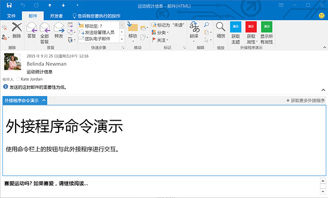


# <a name="custom-pane-outlook-add-ins"></a>自定义窗格 Outlook 外接程序

自定义窗格是当前选定的项在满足特定条件时将激活的外接程序的扩展点。在 **VersionOverrides** 元素中外接程序清单中进行了定义，具有由外接程序实现的任何外接程序命令。有关详细信息，请参阅[在 Outlook 外接程序清单中定义外接程序命令](../outlook/manifests/define-add-in-commands.md)。自定义窗格只能在邮件阅读或约会参与者视图中出现。它在外接程序栏中显示一个条目。当用户单击该条目时，自定义窗格在项的正文上方水平显示。外观和行为与阅读模式外接程序相同，未实现外接程序命令。

**在阅读模式下具有自定义窗格的外接程序**



下面的示例对那些是邮件或具有附件或者包含地址的项目定义自定义窗格。 


```
<ExtensionPoint xsi:type="CustomPane">
  <RequestedHeight>100< /RequestedHeight> 
  <SourceLocation resid="residReadTaskpaneUrl"/>
  <Rule xsi:type="RuleCollection" Mode="Or">
    <Rule xsi:type="ItemIs" ItemType="Message"/>
    <Rule xsi:type="ItemHasAttachment"/>
    <Rule xsi:type="ItemHasKnownEntity" EntityType="Address"/>
  </Rule>
</ExtensionPoint>
```


-  如果在台式计算机上运行，“RequestedHeight”指定此邮件外接程序所需的以像素为单位的高度。如果不是，则它将被忽略。它的值可以介于 32 和 450 之间。如果没有设置值，则默认为 350 像素。可选。
    
-  “SourceLocation” 指定为自定义窗格提供 UI 的 HTML 页面。将 **resid** 属性设置为“Resources”元素中的 **Url** 元素的 **id** 属性的值。必需。
    
-    **Rule** 指定的规则或规则集指定外接程序的激活时间。这与在 [Outlook 外接程序清单](../outlook/manifests/manifests.md)中定义的相同，但有一点除外，即 [ItemIs](http://msdn.microsoft.com/en-us/library/f7dac4a3-1574-9671-1eda-47f092390669%28Office.15%29.aspx) 规则做了以下更改：**ItemType** 是“Message”或“AppointmentAttendee”，并且没有 **FormType** 属性。有关详细信息，请参阅 [Outlook 外接程序的激活规则](../outlook/manifests/activation-rules.md)。
    

## <a name="additional-resources"></a>其他资源


- [适用于 Office 365 的 Outlook 外接程序入门](https://dev.outlook.com/MailAppsGettingStarted)
    
- [Outlook 外接程序的激活规则](../outlook/manifests/activation-rules.md)
    
- [Outlook 外接程序清单](../outlook/manifests/manifests.md)
    
- [在 Outlook 外接程序清单中定义外接程序命令](../outlook/manifests/define-add-in-commands.md)
    
