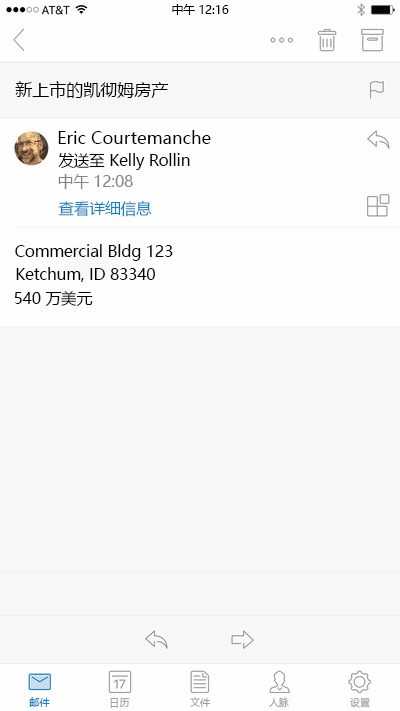

# 适用于 Outlook Mobile 的外接程序 

> **注意：**外接程序可用于 Outlook for iOS。即将推出 Outlook for Android 支持。

现在，外接程序在 Outlook Mobile 上可用，它们使用适用于其他 Outlook 终结点的相同 API。如果已经生成适用于 Outlook 的外接程序，那么则可以很轻松地在 Outlook Mobile 上使用该外接程序。

所有 Office 365 商业帐户均支持 Outlook Mobile 外接程序，且支持范围延伸至 Outlook.com 帐户。

**Outlook for iOS 中的任务窗格示例**

## 在移动电话上会有什么不同？ 

- 移动电话尺寸小，需要进行快速交互，这为设计适用于移动电话的外接程序带来了挑战。为了确保客户体验的质量，我们正在设置严格的验证标准，声明提供移动支持的外接程序必须符合这一标准，以便在 Office 应用商店中获得批准。
    - 外接程序**必须**遵循 [UI 准则](./outlook-addin-design.md)。
    - 外接程序的方案**必须**[能够在移动电话上实现](#what-makes-a-good-scenario-for-mobile-add-ins)。
- 目前仅支持邮件读取。这意味着 `MobileMessageReadCommandSurface` 是应在清单的移动部分唯一声明的 [ExtensionPoint](../../reference/manifest/extensionpoint.md)
- [makeEwsRequestAsync](../../reference/outlook/Office.context.mailbox.md) API 在移动电话上不受支持，因为移动应用使用 REST API 与服务器进行通信。如果应用后端需要连接到 Exchange 服务器，则可以使用回调令牌进行 REST API 调用。有关详细信息，请参阅[从 Outlook 外接程序使用 Outlook REST API](./use-rest-api.md)。
- 如果将外接程序和清单中的 [MobileFormFactor](../../reference/manifest/mobileformfactor.md) 一起提交至应用商店，则需要同意我们添加针对 iOS 上的外接程序的开发人员附录，并且必须提交你的 Apple 开发人员 ID 以进行验证。
- 最后，你的清单将需要声明 `MobileFormFactor`，并包含正确的[控件](../../reference/manifest/control.md)和[图标大小](../../reference/manifest/icon.md)类型。

## 适用于移动外接程序的优秀方案应具备哪些特点？

请记住，电话上 Outlook 会话的平均长度要比在 PC 上短得多。这意味着外接程序必须快速运行，且方案必须允许用户进入、退出，并继续处理他们的电子邮件工作流。

以下是在 Outlook Mobile 中可用的方案示例。

- 外接程序为 Outlook 带来了有价值的信息，帮助用户会审他们的电子邮件并进行适当地响应。示例：可让用户查看客户信息并共享相应信息的 CRM 外接程序。
- 外接程序通过将信息保存到跟踪、协作或类似系统，为用户的电子邮件内容增加价值。示例：允许用户将电子邮件转化为任务项以供项目跟踪，或转化为支持团队的帮助票证的外接程序。

当然，肯定还有其他好方案，如果你有比这些外接程序方案更好的想法，请使用[此处的表格](https://aka.ms/outlookmobileaddin)与我们联系，以获得你的方案对于 Outlook Mobile 而言是否是可接受方案的反馈。我们很乐意提供指导，你提供的信息越详细越好。我们喜欢非常棒的 UI 演练！

**从电子邮件创建 Trello 卡片的用户交互示例**

## 在移动电话上测试外接程序

若要在 Outlook Mobile 上测试外接程序，可以将外接程序旁加载到 O365 或 Outlook.com 帐户。在 Outlook Web App 中，转到“设置齿轮”，并选择“管理集成”或“管理外接程序”。在靠近顶部的位置，单击显示的“单击此处添加自定义外接程序”并上载清单。请确保清单格式正确以包含 `MobileFormFactor`，否则它将不会加载。

外接程序正常工作后，请确保在不同大小的屏幕上对其测试，其中包括手机和平板电脑。应确保其符合对比度、字体大小和颜色这些辅助功能准则，并且还对 iOS 上的 VoiceOver 或 Android 上的 TalkBack 等屏幕阅读器可用。

在移动电话上进行故障排除可能会比较困难，因为可能没有你已习惯使用的工具。进行故障排除的一种选择是[使用 Vorlon.js](../testing/debug-office-add-ins-on-ipad-and-mac.md)。或者，如果你之前使用过 Fiddler，请查看[本教程中有关在 iOS 设备上使用 Fiddler 的内容](http://www.telerik.com/blogs/using-fiddler-with-apple-ios-devices)。

## 后续步骤

- 了解如何[向外接程序的清单中添加移动支持](./manifests/add-mobile-support.md)。
- 了解如何[为外接程序设计出色的移动体验](./outlook-addin-design.md)。
- 了解如何从外接程序[获取访问令牌并调用 Outlook REST API](./use-rest-api.md)